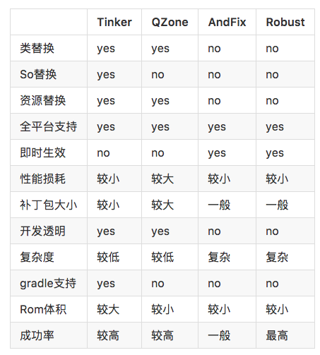

# App之Hotfix

2017-2-6

这里分成Android和iOS两个部分来简单解释一下目前App的Hotfix流行的方法，并简单解释一下原理。在最后说一下，React Native以及Weex的Hotfix的现状

## Andorid

既然叫做hotfix，就表示hotfix并不能完全替代版本发布。但是对于小步快跑来说，或者线上crash问题来说，则有极大的优势。

现在主流的Android的hotfix开源方案有：

* Tinker (7400+ star，wx出品)
* Dexposed (3300+ star, alibaba)
* AndFix （4800+ star, alibaba)
* Robust (闭源, 美团)

几个方案的比较如下：  

### Tinker 原理

原理和 [Hotfix/nuwa](https://github.com/dodola/HotFix) 是类似的，都是通过修改ClassLoader加载dex顺序来完成更新
