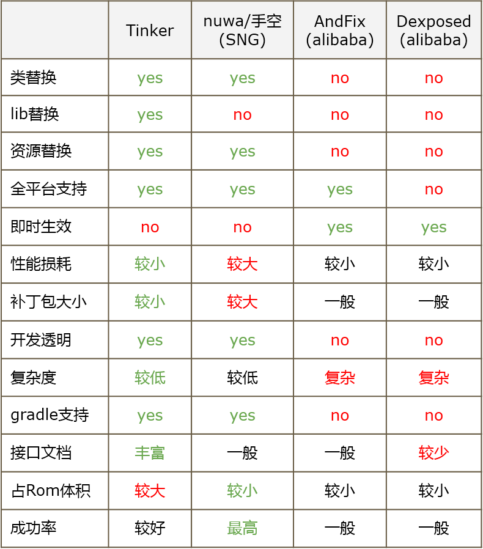
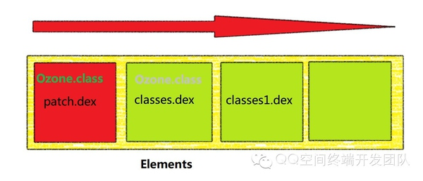
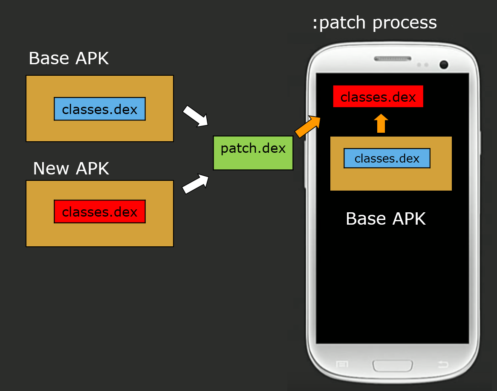

# App之Hotfix

2017-2-6

这里分成Android和iOS两个部分来简单解释一下目前Native App的Hotfix流行的方法，并简单解释一下原理。在最后说一下，React Native以及Weex的Hotfix的现状

## Andorid

既然叫做hotfix，就表示hotfix并不能完全替代版本发布。但是对于小步快跑来说，或者线上crash问题来说，则有极大的优势。

现在主流的Android的hotfix开源方案有：

* AndFix （4800+ star, alibaba)
* [Hotfix (1300+ star)](https://github.com/dodola/HotFix)
* Tinker (7400+ star，wx出品)

几个方案的**优缺点**比较如下：

同时从使用角度而言

**总的来说**:

>AndFix作为native解决方案，首先面临的是稳定性与兼容性问题，更重要的是它无法实现类替换，它是需要大量额外的开发成本的；

>Robust兼容性与成功率较高，但是它与AndFix一样，无法新增变量与类只能用做的bugFix方案；

>Qzone方案(Hotfix)可以做到发布产品功能，但是它主要问题是插桩带来Dalvik的性能问题，以及为了解决Art下内存地址问题而导致补丁包急速增大的。特别是在Android N之后，由于混合编译的inline策略修改，对于市面上的各种方案都不太容易解决。

>而Tinker热补丁方案不仅支持类、So以及资源的替换，它还是2.X－7.X的全平台支持。利用Tinker我们不仅可以用做bugfix,甚至可以替代功能的发布。Tinker已运行在微信的数亿Android设备上。

### **AndFix**原理

AndFix采用native hook的方式，这套方案直接使用dalvik_replaceMethod替换class中方法的实现。由于它并没有整体替换class, 而field在class中的相对地址在class加载时已确定，所以AndFix无法支持新增或者删除filed的情况(通过替换init与clinit只可以修改field的数值)。

### **Hotfix**原理

这个方案使用classloader的方式，能实现友好的类替换。而且这与我们加载Multidex的做法相似，能基本保证稳定性与兼容性。

本方案为了解决unexpected DEX problem异常而采用插桩的方式，从而规避问题的出现。事实上，这会导致QZone方案在Dalvik与Art都会产生一些问题。比如启动时间过长，或者是在ART上，补丁中的类出现修改类变量或者方法，可能会导致出现内存地址错乱的问题。

### **Tinker**原理

原理和 [Instant Run](http://www.jianshu.com/p/2e23ba9ff14b) 的冷更新是类似的，都过全量替换一个完整的dex来达到更新目的。

但是Tinker并非是真正下载整个新的dex文件，而是下载一个diff过的补丁包，然后在本机上再生成新的dex文件。

## iOS

目前主流使用的方案是`JSPatch`, 不过滴滴表示2017年会开源他们自己新开发的DynamicCocoa动态框架。

### JSPatch原理

`JSPatch`核心主要是`JSBinding`和`Objective-C`中的runtime技术。
 JSPatch 的基本原理就是：JS 传递字符串给 OC，OC 通过 Runtime 接口调用和替换 OC 方法。

 一方面，它采用Apple在iOS7中发布的J`avaScriptCore.framework`作为`Javascript`引擎解析`JavaScript`脚本，执行`JavaSript`代码并与`Objective-C`端的代码进行桥接。另一方面则是使用`Objective-C runtime`中的`method swizzling`的方式达到使用`JavaScript`脚本动态替换原有`Objective-C`方法的目的，并利用`ForwardInvocation`标准消息转发机制使得在`JavaScript`脚本中调用`Objective-C`的方法成为可能。
