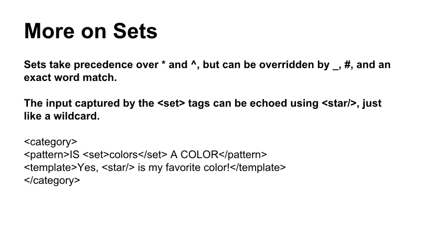

# input pre-processing
### Normalization

### Sentence Splitting

# Categories

### AIML Category

### UDC

### Randomized responses

### Wildcards

### Priority

### variables (上下文)

# Recursion and Reduction

### Colloquial Expressions

### Synonyms

### Reduction

# Sets and Maps
### Set

### Use Set

### Set priority

### Map

### Use Map

# Context
### "that"

### use "that"

### topic

### conditional

### loops

### learn

### list processing

### substitutions

### denormalization

### date and interval

