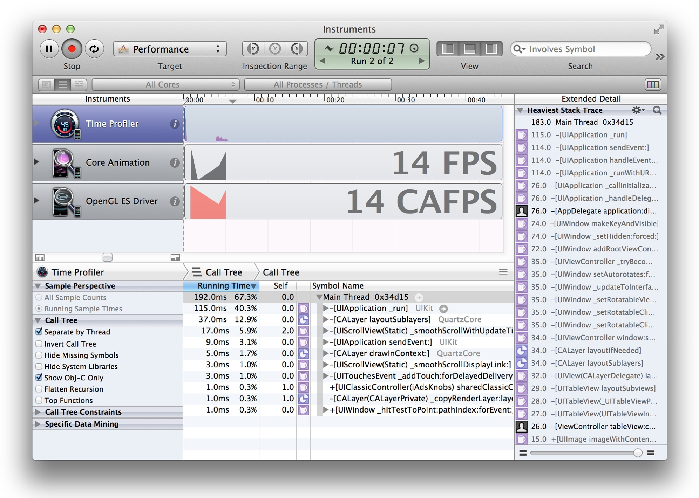
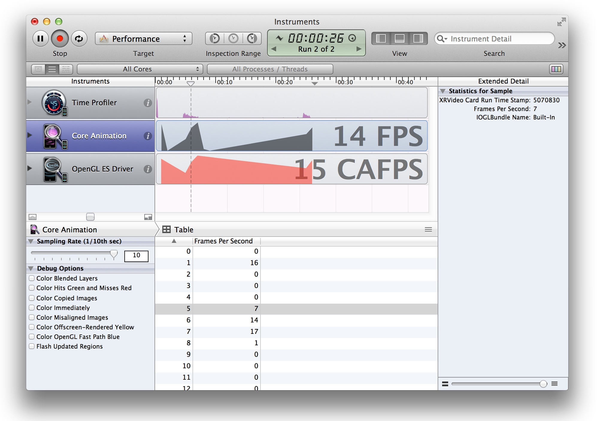
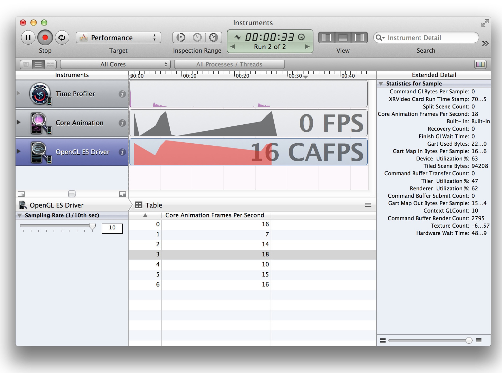

# CA - 性能调优
## CPU VS GPU
---
大多数动画性能优化都是关于智能利用GPU和CPU，使得它们都不会超出负荷。于是我们首先需要知道Core Animation是如何在这两个处理器之间分配工作的。

### 动画的舞台
 Core Animation处在iOS的核心地位：应用内和应用间都会用到它。一个简单的动画可能同步显示多个app的内容，例如当在iPad上多个程序之间使用手势切换，会使得多个程序同时显示在屏幕上。

**动画和屏幕上组合的图层实际上被一个单独的进程管理。这个进程就是所谓的`渲染服务`。在iOS5和之前的版本是`SpringBoard`进程（同时管理着iOS的主屏）。在iOS6之后的版本中叫做`BackBoard`**

当运行一段动画时候，这个过程会被四个分离的阶段被打破：
* 布局 - 这是准备你的视图/图层的层级关系，以及设置图层属性（位置，背景色，边框等等）的阶段。
* 显示 - 这是图层的寄宿图片被绘制的阶段。绘制有可能涉及你的`-drawRect:`和`-drawLayer:inContext:`方法的调用路径。
* 准备 - 这是Core Animation准备发送动画数据到渲染服务的阶段。这同时也是`Core Animation`将要执行一些别的事务例如解码动画过程中将要显示的图片的时间点。
* 提交 - 这是最后的阶段，Core Animation打包所有图层和动画属性，然后通过`IPC`（内部处理通信）发送到渲染服务进行显示。

但是这些仅仅阶段仅仅发生在你的应用程序之内，在动画在屏幕上显示之前仍然有更多的工作。一旦打包的图层和动画到达渲染服务进程，他们会被反序列化来形成另一个叫做渲染树的图层树（在第一章“图层树”中提到过）。使用这个树状结构，渲染服务对动画的每一帧做出如下工作：

* 对所有的图层属性计算中间值，设置OpenGL几何形状（纹理化的三角形）来执行渲染
* 在屏幕上渲染可见的三角形

所以一共有六个阶段；最后两个阶段在动画过程中不停地重复。前五个阶段都在软件层面处理（通过CPU），只有最后一个被GPU执行。而且，**你真正只能控制前两个阶段：布局和显示**。Core Animation框架在内部处理剩下的事务，你也控制不了它。但这并不是个问题，因为在布局和显示阶段，你可以决定哪些由CPU执行，哪些交给GPU去做。

### GPU相关的操作
宽泛的说，大多数`CALayer`的属性都是用GPU来绘制。比如如果你设置图层背景或者边框的颜色，那么这些可以通过着色的三角板实时绘制出来。

但是有一些事情会降低（基于GPU）图层绘制，比如：
* 太多的几何结构 - 这发生在需要太多的三角板来做变换，以应对处理器的栅格化的时候。现代iOS设备的图形芯片可以处理几百万个三角板，所以在Core Animation中几何结构并不是GPU的瓶颈所在。但由于图层在显示之前通过IPC发送到渲染服务器的时候（图层实际上是由很多小物体组成的特别重量级的对象），太多的图层就会引起CPU的瓶颈。这就限制了一次展示的图层个数。
* 重绘 - 主要由重叠的半透明图层引起。GPU的填充比率（用颜色填充像素的比率）是有限的，所以需要避免重绘（每一帧用相同的像素填充多次）的发生。
* 离屏绘制 - 这发生在当不能直接在屏幕上绘制，并且必须绘制到离屏图片的上下文中的时候。离屏绘制发生在基于CPU或者是GPU的渲染，或者是为离屏图片分配额外内存，以及切换绘制上下文，这些都会降低GPU性能。对于特定图层效果的使用，比如圆角，图层遮罩，阴影或者是图层光栅化都会强制Core Animation提前渲染图层的离屏绘制。但这不意味着你需要避免使用这些效果，只是要明白这会带来性能的负面影响。
* 过大的图片 - 如果视图绘制超出GPU支持的2048x2048或者4096x4096尺寸的纹理，就必须要用CPU在图层每次显示之前对图片预处理，同样也会降低性能。

### CPU相关的操作
大多数工作在`Core Animation`的CPU工作都发生在动画开始之前。这意味着它不会影响到帧率，所以很好，但是他会延迟动画开始的时间，让你的界面看起来会比较迟钝。

以下CPU的操作都会延迟动画的开始时间：
* 布局计算 - 如果你的视图层级过于复杂，当视图呈现或者修改的时候，计算图层帧率就会消耗一部分时间。特别是使用iOS6的自动布局机制尤为明显，它应该是比老版的自动调整逻辑加强了CPU的工作。
* 视图懒加载 - iOS只会当视图控制器的视图显示到屏幕上时才会加载它。这对内存使用和程序启动时间很有好处，但是当呈现到屏幕上之前，按下按钮导致的许多工作都会不能被及时响应。比如控制器从数据库中获取数据，或者视图从一个nib文件中加载，或者涉及IO的图片显示，都会比CPU正常操作慢得多。
* Core Graphics绘制 - 如果对视图实现了`-drawRect:`方法，或者`CALayerDelegate`的`-drawLayer:inContext:`方法，那么在绘制任何东西之前都会产生一个巨大的性能开销。为了支持对图层内容的任意绘制，Core Animation必须创建一个内存中等大小的寄宿图片。然后一旦绘制结束之后，必须把图片数据通过IPC传到渲染服务器。在此基础上，Core Graphics绘制就会变得十分缓慢，所以在一个对性能十分挑剔的场景下这样做十分不好。
* 解压图片 - PNG或者JPEG压缩之后的图片文件会比同质量的位图小得多。但是在图片绘制到屏幕上之前，必须把它扩展成完整的未解压的尺寸（通常等同于图片宽 x 长 x 4个字节）。为了节省内存，iOS通常直到真正绘制的时候才去解码图片。根据你加载图片的方式，第一次对图层内容赋值的时候（直接或者间接使用UIImageView）或者把它绘制到Core Graphics中，都需要对它解压，这样的话，对于一个较大的图片，都会占用一定的时间。

当图层被成功打包，发送到渲染服务器之后，CPU仍然要做如下工作：为了显示屏幕上的图层，`Core Animation`必须对渲染树种的每个可见图层通过OpenGL循环转换成纹理三角板。由于GPU并不知晓`Core Animation`图层的任何结构，所以必须要由CPU做这些事情。这里CPU涉及的工作和图层个数成正比，所以如果在你的层级关系中有太多的图层，就会导致CPU没一帧的渲染，即使这些事情不是你的应用程序可控的。

## 测量，而不是猜测
---
* 真机测试，而不是模拟器
* 保持一致的帧率

## Instruments
---
### 时间分析器
时间分析器工具用来检测CPU的使用情况。它可以告诉我们程序中的哪个方法正在消耗大量的CPU时间。

时间分析器有一些选项来帮助我们定位到我们关心的的方法。可以使用左侧的复选框来打开。其中最有用的是如下几点：
* 通过线程分离 - 这可以通过执行的线程进行分组。如果代码被多线程分离的话，那么就可以判断到底是哪个线程造成了问题。
* 隐藏系统库 - 可以隐藏所有苹果的框架代码，来帮助我们寻找哪一段代码造成了性能瓶颈。由于我们不能优化框架方法，所以这对定位到我们能实际修复的代码很有用。
* 只显示Obj-C代码 - 隐藏除了Objective-C之外的所有代码。大多数内部的Core Animation代码都是用C或者C++函数，所以这对我们集中精力到我们代码中显式调用的方法就很有用。

### Core Animation

Core Animation工具也提供了一系列复选框选项来帮助调试渲染瓶颈：
* Color Blended Layers - 这个选项基于渲染程度对屏幕中的混合区域进行绿到红的高亮（也就是多个半透明图层的叠加）。由于重绘的原因，混合对GPU性能会有影响，同时也是滑动或者动画帧率下降的罪魁祸首之一。
* ColorHitsGreenandMissesRed - 当使用shouldRasterizep属性的时候，耗时的图层绘制会被缓存，然后当做一个简单的扁平图片呈现。当缓存再生的时候这个选项就用红色对栅格化图层进行了高亮。如果缓存频繁再生的话，就意味着栅格化可能会有负面的性能影响了（更多关于使用shouldRasterize的细节见第15章“图层性能”）。
* Color Copied Images - 有时候寄宿图片的生成意味着Core Animation被强制生成一些图片，然后发送到渲染服务器，而不是简单的指向原始指针。这个选项把这些图片渲染成蓝色。复制图片对内存和CPU使用来说都是一项非常昂贵的操作，所以应该尽可能的避免。
* Color Immediately - 通常Core Animation Instruments以每毫秒10次的频率更新图层调试颜色。对某些效果来说，这显然太慢了。这个选项就可以用来设置每帧都更新（可能会影响到渲染性能，而且会导致帧率测量不准，所以不要一直都设置它）。
* Color Misaligned Images - 这里会高亮那些被缩放或者拉伸以及没有正确对齐到像素边界的图片（也就是非整型坐标）。这些中的大多数通常都会导致图片的不正常缩放，如果把一张大图当缩略图显示，或者不正确地模糊图像，那么这个选项将会帮你识别出问题所在。
* Color Offscreen-Rendered Yellow - 这里会把那些需要离屏渲染的图层高亮成黄色。这些图层很可能需要用shadowPath或者shouldRasterize来优化。
* Color OpenGL Fast Path Blue - 这个选项会对任何直接使用OpenGL绘制的图层进行高亮。如果仅仅使用UIKit或者Core Animation的API，那么不会有任何效果。如果使用GLKView或者CAEAGLLayer，那如果不显示蓝色块的话就意味着你正在强制CPU渲染额外的纹理，而不是绘制到屏幕。
* Flash Updated Regions - 这个选项会对重绘的内容高亮成黄色（也就是任何在软件层面使用Core Graphics绘制的图层）。这种绘图的速度很慢。如果频繁发生这种情况的话，这意味着有一个隐藏的bug或者说通过增加缓存或者使用替代方案会有提升性能的空间。

### OpenGL ES驱动

侧栏的右边是一系列有用的工具。其中和Core Animation性能最相关的是如下几点：
* Renderer Utilization - 如果这个值超过了~50%，就意味着你的动画可能对帧率有所限制，很可能因为离屏渲染或者是重绘导致的过度混合。
* Tiler Utilization - 如果这个值超过了~50%，就意味着你的动画可能限制于几何结构方面，也就是在屏幕上有太多的图层占用了。
