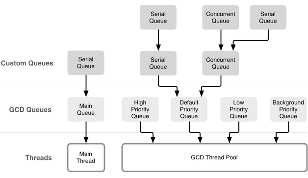

# 并发编程：API 及挑战

## OS X 和 iOS 中的并发编程
- - -
本文会介绍 pthread、 NSThread 、GCD 、NSOperationQueue，以及 NSRunLoop

### 线程
可以使用POSIX线程API(*pthread*)和NSThread API，但是他们都很丑陋。

    直接使用线程可能会引发的一个问题是，如果你的代码和所基于的
    框架代码都创建自己的线程时，那么活动的线程数量有可能以指数
    级增长。

### Grand Central Dispatch
通过 GCD，开发者只需要向队列中添加代码块即可，GCD 在后端管理着一个`线程池`。GCD决定着你的代码块将在哪个线程被执行，它还根据可用的系统资源对这些线程进行管理。

GCD 带来的另一个重要改变是，作为开发者可以将工作考虑为一个队列，而不是一堆线程，这种并行的抽象模型更容易掌握和使用

    GCD 公开有 5 个不同的队列：运行在主线程中的 main queue
    ，3 个不同优先级的后台队列，以及一个优先级更低的后台队列
    （用于 I/O）。 另外，开发者可以创建自定义队列：串行或者
    并行队列。在自定义队列中被调度的所有block 最终都将被放入
    到系统的全局队列中和线程池中。

### Operation Queues
操作队列（operation queue）是由 GCD 提供的一个队列模型的 Cocoa 抽象。

NSOperationQueue 有两种不同类型的队列：主队列和自定义队列。主队列运行在主线程之上，而自定义队列在后台执行。

>在两种类型中，这些队列所处理的任务都使用 NSOperation 的子类来表述。
>你可以通过重写 `main` 或者 `start` 方法来定义自己的 operations。

### Run Loops
`run loop`并不能并行执行任务。不过在主 `dispatch/operation` 队列中， `run loop`提供了一种异步执行代码的机制。

一个 `run loop` 总是绑定到某个特定的线程中。

`main run loop` 是与主线程相关的，负责处理 UI 事件、计时器，以及其它内核相关事件。无论你什么时候设置计时器、使用 `NSURLConnection` 或者调用 `performSelector:withObject:afterDelay:`，其实背后都是 `run loop` 在处理这些异步任务。

**`run loop` 可以运行在不同的模式中**，每种模式都定义了一组事件。不同模式可以使得iOS主线程中临时性的调整某些任务的优先级的。

>非常典型的一个示例就是滚动。在进行滚动时，`run loop` 并不是运行在default模式中的，因此， run loop 此时并不会响应比如滚动前设置的计时器。一旦滚动停止了，run loop 会回到默认模式，并执行添加到队列中的相关事件。如果在滚动时，希望计时器能被触发，需要将其设为 `NSRunLoopCommonModes` 的模式，并添加到 run loop 中

主线程一般来说都已经配置好了 `main run loop`。然而其他线程默认情况下都没有设置 run loop。

如果需要在别的线程中添加一个 `run loop` ，那么不要忘记在 `run loop` 中至少添加一个 `input source` 。

### BTW: Concurrent Versus Non-concurrent Operations

<u>不要创建并发Operation，除非你不使用OperationQueue</u>

>Although you typically execute operations by adding them to an operation queue, doing so is not required. It is also possible to execute an operation object manually by calling its start method, but doing so does not guarantee that the operation runs concurrently with the rest of your code. The isConcurrent method of the NSOperation class tells you whether an operation runs synchronously or asynchronously with respect to the thread in which its start method was called. By default, this method returns NO, which means the operation runs synchronously in the calling thread.

>If you want to implement a concurrent operation—that is, one that runs asynchronously with respect to the calling thread—you must write additional code to start the operation asynchronously. For example, you might spawn a separate thread, call an asynchronous system function, or do anything else to ensure that the start method starts the task and returns immediately and, in all likelihood, before the task is finished.

>Most developers should never need to implement concurrent operation objects. <u><b>*If you always add your operations to an operation queue, you do not need to implement concurrent operations.*</b></u> When you submit a nonconcurrent operation to an operation queue, the queue itself creates a thread on which to run your operation. Thus, adding a nonconcurrent operation to an operation queue still results in the asynchronous execution of your operation object code. The ability to define concurrent operations is only necessary in cases where you need to execute the operation asynchronously without adding it to an operation queue.
