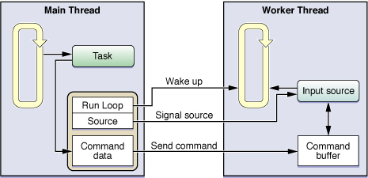

# Run Loops
A run loop is an event processing loop that you use to schedule work and coordinate the receipt of incoming events. The purpose of a run loop is to keep your thread busy when there is work to do and put your thread to sleep when there is none.

Run loop management is not entirely automatic. You must still design your thread’s code to start the run loop at appropriate times and respond to incoming events. Both Cocoa and Core Foundation provide run loop objects to help you configure and manage your thread’s run loop. Your application does not need to create these objects explicitly; each thread, including the application’s main thread, has an associated run loop object. Only secondary threads need to run their run loop explicitly, however.

## Anatomy of a Run Loop
---
It is a loop your thread enters and uses to run event handlers in response to incoming events. Your code provides the control statements used to implement the actual loop portion of the run loop—in other words, **your code provides the `while` or `for` loop that drives the run loop.** Within your loop, you use a run loop object to "run” the event-processing code that receives events and calls the installed handlers.

A run loop receives events from two different types of sources. `Input sources` deliver asynchronous events, usually messages from another thread or from a different application. `Timer sources` deliver synchronous events, occurring at a scheduled time or repeating interval.

**Structure of a run loop and its sources**


In addition to handling sources of input, run loops also generate **notifications** about the run loop’s behavior. Registered `run-loop observers` can receive these notifications and use them to do additional processing on the thread. You use Core Foundation to install run-loop observers on your threads.

### Run Loop Modes
A `run loop mode` is a collection of input sources and timers to be monitored and a collection of run loop observers to be notified. Each time you run your run loop, you specify (either explicitly or implicitly) a particular “mode” in which to run. During that pass of the run loop, only sources associated with that mode are monitored and allowed to deliver their events. (Similarly, only observers associated with that mode are notified of the run loop’s progress.) Sources associated with other modes hold on to any new events until subsequent passes through the loop in the appropriate mode.

In your code, you identify modes by name. Both Cocoa and Core Foundation define a default mode and several commonly used modes, along with strings for specifying those modes in your code. You can define custom modes by simply specifying a custom string for the mode name. Although the names you assign to custom modes are arbitrary, the contents of those modes are not. You must be sure to add one or more input sources, timers, or run-loop observers to any modes you create for them to be useful.

You use modes to <u>filter</u> out events from unwanted sources during a particular pass through your run loop.

#### Input Sources
`Input sources` deliver events asynchronously to your threads, including two categories, `Port-based input sources` and `Custom input sources`. The only difference between the two sources is how they are signaled. Port-based sources are signaled automatically by the kernel, and custom sources must be signaled manually from another thread.

##### Port-Based Sources
In Cocoa, you never have to create an input source directly at all. You simply create a port object and use the methods of NSPort to add that port to the run loop. The port object handles the creation and configuration of the needed input source for you.

In Core Foundation, you must manually create both the port and its run loop source.

##### Custom Input Sources
To create a custom input source, you must use the functions associated with the CFRunLoopSourceRef opaque type in Core Foundation. You configure a custom input source using several callback functions. Core Foundation calls these functions at different points to configure the source, handle any incoming events, and tear down the source when it is removed from the run loop.

##### Cocoa Perform Selector Sources
In addition to port-based sources, Cocoa defines a custom input source that allows you to perform a selector on any thread. Like a port-based source, perform selector requests are serialized on the target thread, alleviating many of the synchronization problems that might occur with multiple methods being run on one thread. Unlike a port-based source, a perform selector source removes itself from the run loop after it performs its selector.

##### Timer Sources
Although it generates time-based notifications, a timer is not a real-time mechanism. Like input sources, timers are associated with specific modes of your run loop. If a timer is not in the mode currently being monitored by the run loop, it does not fire until you run the run loop in one of the timer’s supported modes.

##### Run Loop Observers
* The entrance to the run loop.
* When the run loop is about to process a timer.
* When the run loop is about to process an input source.
* When the run loop is about to go to sleep.
* When the run loop has woken up, but before it has processed the event that woke it up.
* The exit from the run loop.

>Similar to timers, run-loop observers can be used once or repeatedly. A one-shot observer removes itself from the run loop after it fires, while a repeating observer remains attached. You specify whether an observer runs once or repeatedly when you create it.

## Using Run Loop Objects
---
### Getting a Run Loop Object
* In a Cocoa application, use the `currentRunLoop` class method of `NSRunLoop` to retrieve an `NSRunLoop` object
* Use the `CFRunLoopGetCurrent` function.

### Configuring the Run Loop
```
- (void)threadMain
{
    // The application uses garbage collection, so no autorelease pool is needed.
    NSRunLoop* myRunLoop = [NSRunLoop currentRunLoop];

    // Create a run loop observer and attach it to the run loop.
    CFRunLoopObserverContext  context = {0, self, NULL, NULL, NULL};
    CFRunLoopObserverRef    observer = CFRunLoopObserverCreate(kCFAllocatorDefault,
            kCFRunLoopAllActivities, YES, 0, &myRunLoopObserver, &context);

    if (observer)
    {
        CFRunLoopRef    cfLoop = [myRunLoop getCFRunLoop];
        CFRunLoopAddObserver(cfLoop, observer, kCFRunLoopDefaultMode);
    }

    // Create and schedule the timer.
    [NSTimer scheduledTimerWithTimeInterval:0.1 target:self
                selector:@selector(doFireTimer:) userInfo:nil repeats:YES];

    NSInteger    loopCount = 10;
    do
    {
        // Run the run loop 10 times to let the timer fire.
        [myRunLoop runUntilDate:[NSDate dateWithTimeIntervalSinceNow:1]];
        loopCount--;
    }
    while (loopCount);
}
```

>When configuring the run loop for a long-lived thread, it is better to add at least one input source to receive messages. Although you can enter the run loop with only a timer attached, once the timer fires, it is typically invalidated, which would then cause the run loop to exit. Attaching a repeating timer could keep the run loop running over a longer period of time, but would involve firing the timer periodically to wake your thread, which is effectively **another form of polling**. By contrast, **an input source waits** for an event to happen, **keeping your thread asleep** until it does.

### Starting the Run Loop
Starting the run loop is necessary only for the secondary threads in your application. A `run loop` must have at least `one input source` or `timer` to monitor. If one is not attached, the run loop exits immediately.

There are several ways to start the run loop, including the following:

* Unconditionally
* With a set time limit
* In a particular mode

```
- (void)skeletonThreadMain
{
    // Set up an autorelease pool here if not using garbage collection.
    BOOL done = NO;

    // Add your sources or timers to the run loop and do any other setup.

    do
    {
        // Start the run loop but return after each source is handled.
        SInt32    result = CFRunLoopRunInMode(kCFRunLoopDefaultMode, 10, YES);

        // If a source explicitly stopped the run loop, or if there are no
        // sources or timers, go ahead and exit.
        if ((result == kCFRunLoopRunStopped) || (result == kCFRunLoopRunFinished))
            done = YES;

        // Check for any other exit conditions here and set the
        // done variable as needed.
    }
    while (!done);

    // Clean up code here. Be sure to release any allocated autorelease pools.
}
```

## Configuring Run Loop Sources
---
Figure 3-2 shows a sample configuration of a custom input source. In this example, the application’s main thread maintains references to the input source, the custom command buffer for that input source, and the run loop on which the input source is installed. When the main thread has a task it wants to hand off to the worker thread, it posts a command to the command buffer along with any information needed by the worker thread to start the task. (Because both the main thread and the input source of the worker thread have access to the command buffer, that access must be synchronized.) Once the command is posted, the main thread signals the input source and wakes up the worker thread’s run loop. Upon receiving the wake up command, the run loop calls the handler for the input source, which processes the commands found in the command buffer.


