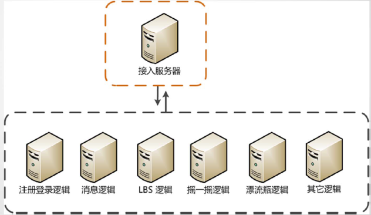
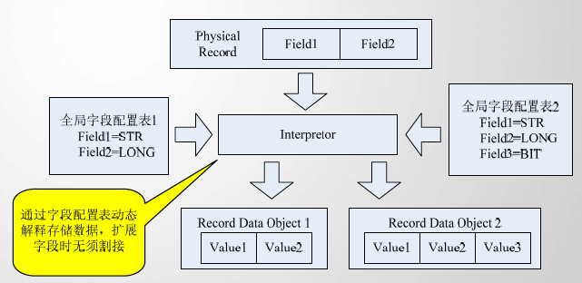
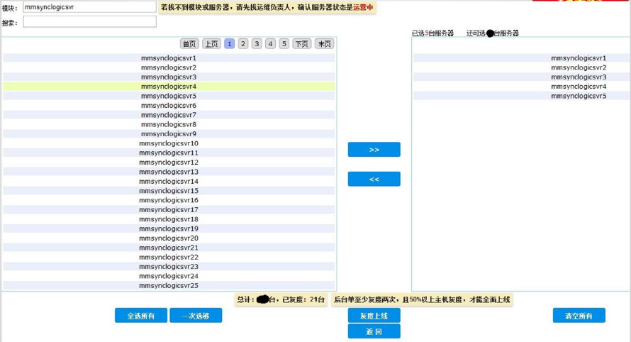
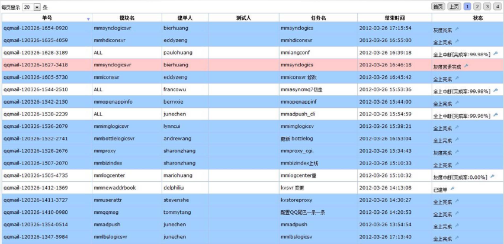
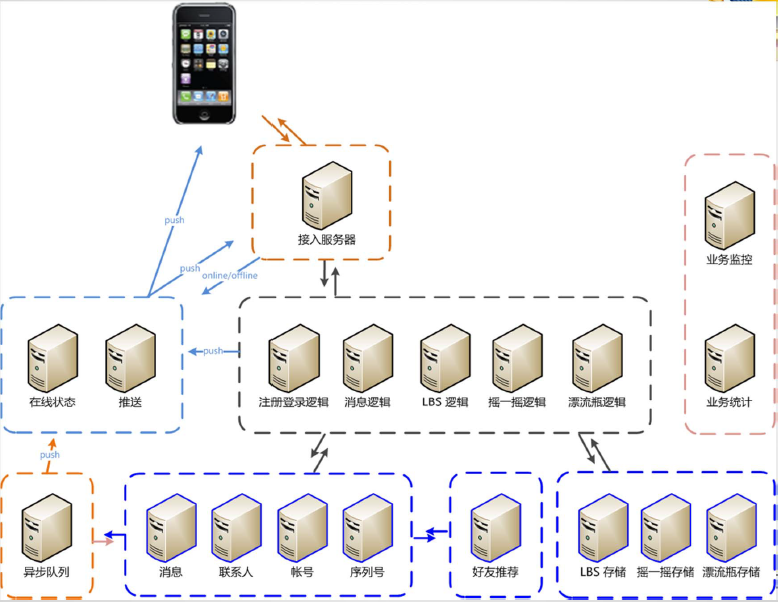
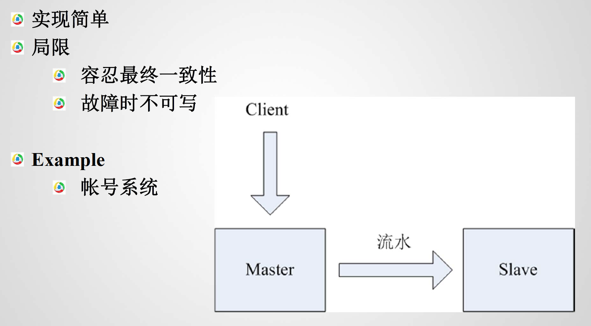
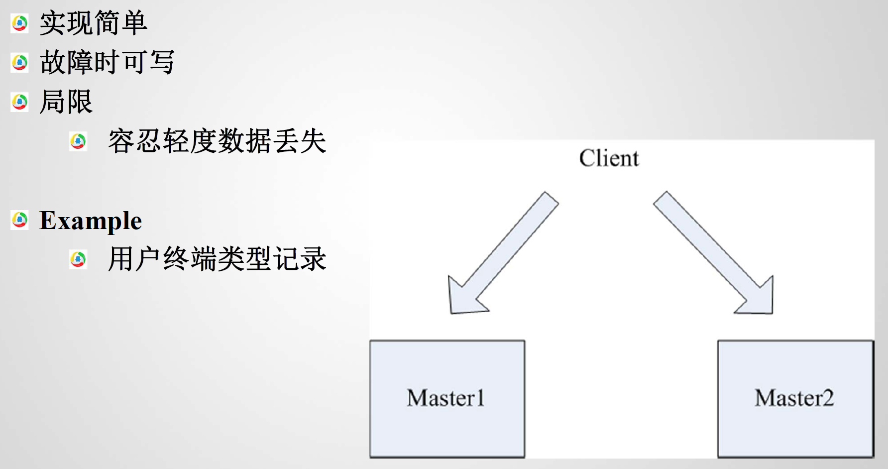
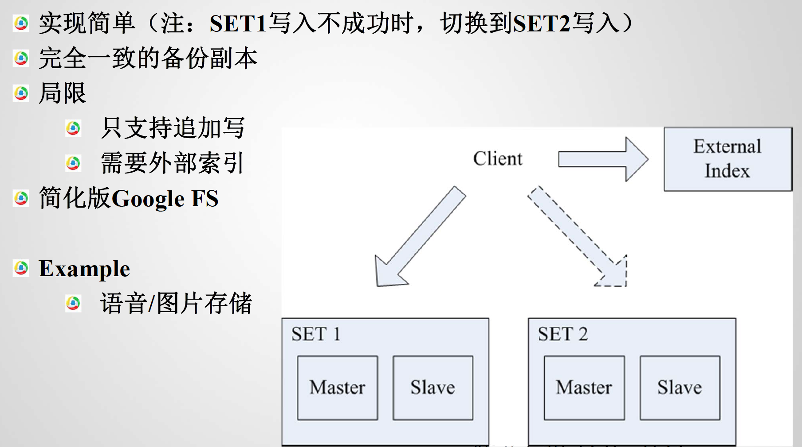
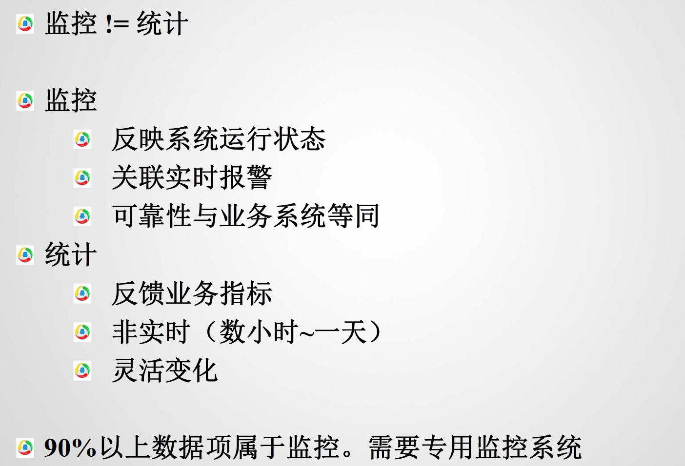
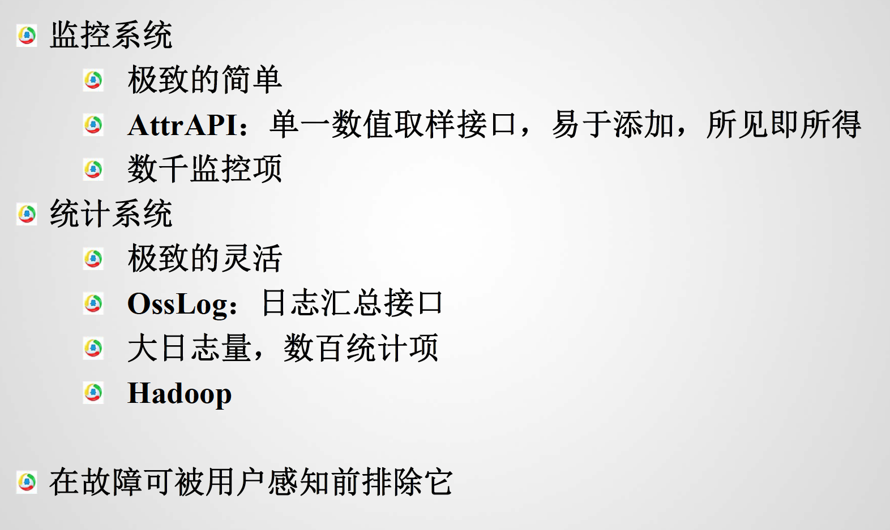

# 微信服务器设计

## 敏捷是一种态度
* 产品决策是成功的第一因素
* 允许发布前十分钟的变更
* 给予产品决策以最大自由度

## 技术来支撑敏捷
* 大系统小做
* 让一切可扩展
* 要有基础组件
* 轻松的上线
  * 灰度，灰度，再灰度
  * 精细的监控
  * 迅速的响应

### 大系统小做
高度内聚，划分粒度更细

### 让一切可扩展
协议和数据存储都可扩展，并且使用某种编辑器（xml或者配置表）来自动生成
* 网络协议可扩展
  * XML描述
  * 向前兼容
  * 代码自动生成（ProtocolBuffer & TLV）
* 数据存储可扩展
  * KV or TLV
  * 字段配置表
  * 类SQL处理

### 基础组件来屏蔽复杂性
* Svrkit：Client/Server自动代码生成框架，用来自动部署
* LogicServer：逻辑容器，只负责添加新逻辑，而不用在乎如何耦合到服务器上
* OssAgent：监控/统计框架，所见即所得的监控报表
* 存储组件: 屏蔽容灾/扩容等复杂问题

#### 灰度自动化

## 剥离复杂，让剩下的更简单
微信后台架构图

### 关注复杂点
* 协议
* 容灾
* 轻重
* 监控

#### 协议

##### 移动互联网的复杂性
  * CMWAP vs. CMNET
  * 在线vs. 离线
  * 连接不稳定
  * 资费敏感
  * 高延迟

##### 业界标准方案
* Messaging And Presence Protocol
  * XMPP
  * SIP/SIMPLE
* 优点：
  * 简单，大量开源实现
* 缺点
  * 流量大：状态初始化
  * 消息不可靠
* SYNC协议
  * 参考ActiveSync
  * 状态同步：Sync by SyncKey
  * 模式简化：Notify & Client Pull
  * 让剩下的更简单
    * 简化交互模式
    * 最小增量传输
    * 最优重传控制
    * More important：消息可靠传输& 按序到达

#### 容灾
* 如果容灾不了怎么办？
  * 防止雪崩，避免蝴蝶效应
    * 防雪崩内置到组件
  * 柔性可用，追求不完美
  * 保护点前置，比如放到前端（前端转接idc之类的）
* 接入层GSLB,LVS,IP redirect, Client retry ...
* 逻辑层，不要有状态
* 存储层容灾
  * 分而治之
* 主备

* 双写

* Set+双写

* 监控和统计

